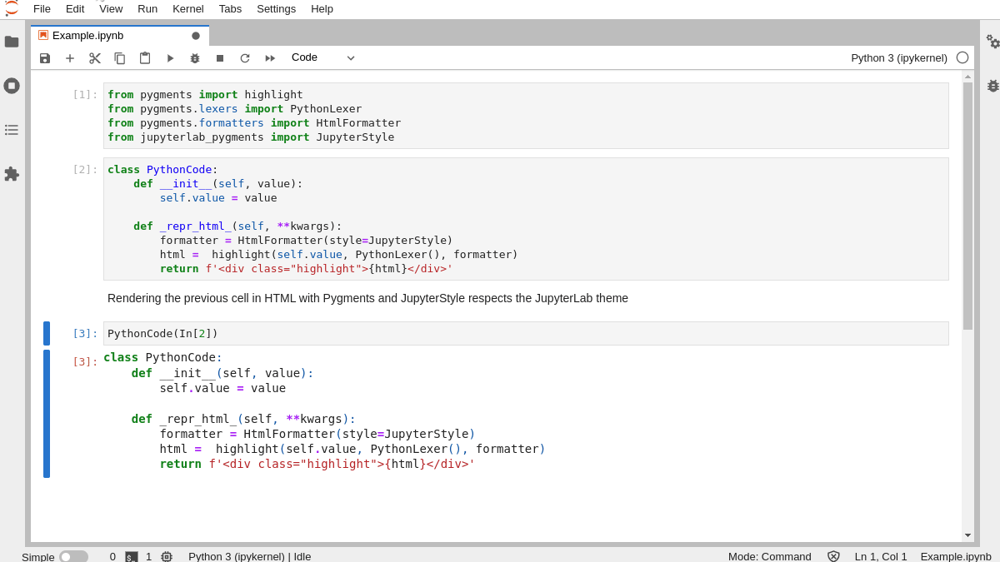

# JupyterLab Pygments Theme

This package contains a syntax coloring theme for [pygments](http://pygments.org/) making use of
the JupyterLab CSS variables.

The goal is to enable the use of JupyterLab's themes with pygments-generated HTML.

## Screencast

In the following screencast, we demonstrate how Pygments-highlighted code can make use of the JupyterLab theme.



## Installation

`jupyterlab_pygments` can be installed with the conda package manager

```
conda install -c conda-forge jupyterlab_pygments
```

or from pypi

```
pip install jupyterlab_pygments
```

## Dependencies

- `jupyterlab_pygments` requires [pygments](http://pygments.org) version `2.4.1`.
- The CSS variables used by the theme correspond to the CodeMirror syntex coloring
  theme defined in the NPM package [@jupyterlab/codemirror](https://www.npmjs.com/package/@jupyterlab/codemirror) as of version `0.19.1`.

## Limitations

Pygments-generated HTML and CSS classes are not granular enough to reproduce
all of the details of codemirror (the JavaScript text editor used by JupyterLab).

This includes the ability to differentiate properties from general names.

## License

`jupyterlab_pygments` uses a shared copyright model that enables all contributors to maintain the
copyright on their contributions. All code is licensed under the terms of the revised [BSD license](LICENSE).

